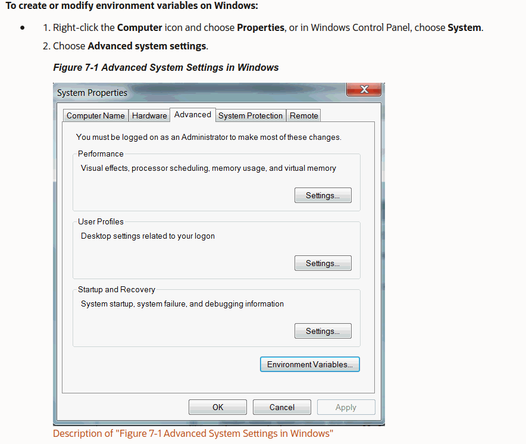
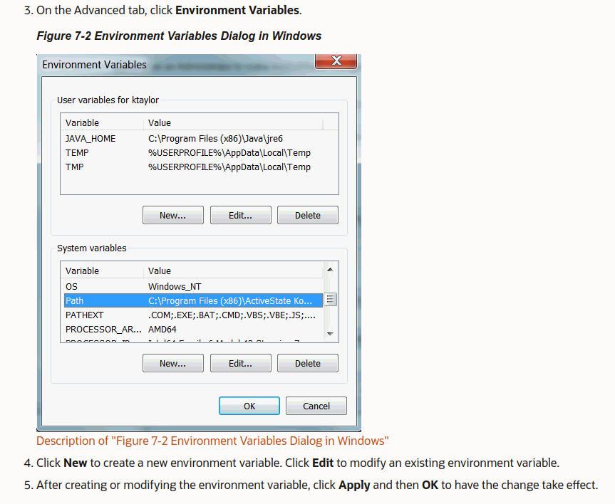

# HavocOS-Web # 

The Havoc OS Website.

## Dependencies (optional): ##
- sudo apt install postgresql-11 pgadmin4 postgresql-server-dev-11 libpq-dev postgresql-client-11

## Installing Python package dependencies ##
- pip install -r requirements.txt

## Setting up Environment Variables in Linux ##
- export *variable-name*='*variable-value*'

## Setting up Environment Variable in Windows ##

 

 For more info regarding setting up Environment Variables in Windows, go through [this link](https://www.youtube.com/watch?v=IolxqkL7cD8).